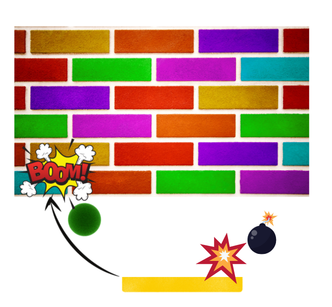

# 
Breakout Revenge

I built this game for my second milestone project for the Code Institutes Full Stack Software Development Course. The goal of the project was to build an interactive frontend game where users could play against themselves in a battle to win the game. The game is a clone of the original Atari Breakout game but with a twist. In order to win the game, the player must smash all bricks without losing the ball. The player has three lives within each level - to make it little easier for them. 

The twist to the game involves a bit of fight back. At some point in each game, Killer Red bricks will start to fall from the sky in a bit to kill the player. If the player gets hit by a brick - it’s instant GAME OVER! The bricks will fall from random points so it’s impossible to predict their next move.

The game has two levels at the moment, with more challenging levels planned for future releases.

The image above is a visual of the site displayed on different devices using [I Am Responsive](http://ami.responsivedesign.is/#)

### 
You can view the live site here: [www.breakout-revenge.com](https://scotty-james.github.io/Breakout-MS2/)

---

### 
This game has been built for desktop only. To play, use the arrow keys to move the player from left to right.

---

## Contents

- [**User Experience (UX)**](#ux)
  - [User Stories](#user-stories)
  - [Strategy](#strategy)
    - [_External user’s goal_](#external-user’s-goal)
    - [_Site owner's goal_](#external-user’s-goal)
  - [Scope](#scope)
    - [_Scope In_](#scope-in)
    - [_Scope Out_](#scope-out)
  - [Structure](#structure)
  - [Skeleton](#skeleton)
    - [_Wireframes_](#mobile-wireframes)
  - [Surface](#surface)
    - [_Design_](#design)
    - [_Colour_](#colour)
    - [_Typography_](#typography)
- [**Features**](#features)
  - [_Existing Features_](#existing-features)
  - [_Features Left to Implement_](#features-left-to-implement)
- [**Technologies Used**](#technologies-used)
  - [_Languages_](#languages)
  - [_Frameworks & Libraries_](#frameworks-and-libraries)
- [**Testing**](#testing)
- [**Version Control Management**](#version-control-management)
- [**Deployment**](#deployment)
  - [_Deployment Steps_](#deployment-steps)
  - [_How To run this Project Locally_](#how-to-run-this-project-locally)
- [**Credits**](#credits)
  - [_Content_](#content)
  - [_Media_](#media)
  - [_Code_](#code)
- [**Resources**](#resources)
- [**Acknowledgements**](#acknowledgements)

## 
 UX

### User Stories

- As a player, I want to see the game instructions before I play, so that my game experience is fun and enjoyable.
- As a player, I want to be able to see my score as a play, so that I can feel a sense of competition against myself.
- As a player, I want to play a game that adds further challenge in each level so that I can remain interested in the game as I master each level.
- As a player, I want to see my final score even when I lose the game, so that I can aim to beat that score next time.
- As a player, I want the game to be unpredictable in some way, so that the game doesn't become too static or boring.

### Strategy

#### External user’s goal

- Play a game that is fun and interactive, that adds challenge to each level as the game progresses.
- Play a single player game where I can compete against myself.
- The game must be easy to play, using as little keyboard inputs as possible.
- The game should include a score count and overall final score for each level - whether the game has been won or lost.
- To sustain interest, the game should have multiple levels that become more challenging as the game progresses.

#### Site owner's goal

- Create a game for single player game enthusiasts, where they need to achieve a certain goal in order to win the game.
- Create a game that has multiple levels to ensure that the player’s interest in the game is sustained for as long as possible.
- Create a game that provides additional challenge for each level introduced, making it harder to win as the player develops their game skills in each level.
- Create a game that provides the environment for self competition, building the players enthusiasm to beat their score each time they lose/win.

### Scope

#### Scope In

- A retro style game for desktop use only where the user can play using their desktop keyboard keys to navigate.
- A game instructions button (modal) that provides the user with instruction on how to play the game.
- A preload screen that allows the player to start the game once they’ve read the game instructions.
- A score counter that increases each time the player smashes a brick within the game.
- A lives counter that allows the player to continue on with the game should they lose their ball before smashing all the bricks in a given level. Each level with provide the user with 3 lives.
- Additional challenge in the form of falling bricks, where the user will be killed instantly if they are hit by them.
- A final score display on either a game win or game lose scenario.
- Two levels with the second level offering more challenge than the first - in the form of a faster moving ball, and more bricks to destroy.
- Animation in the form of explosion when the ball collides with each brick, when a falling brick collides with the player, and the changing of player colour when the user loses the game.
- Sound effects for player and ball collision events.

#### Scope Out

- The game has initially been built for desktop only, therefore ability to play on a mobile device is out of scope for this first release.
- Mouse input as a way to control the game
- High score functionality that displayed the users highest score over multiple attempts.

### Structure

The structure of information of the game will follow a simple approach with 5 game scenes: These scense will follow a path dependant on the game outcome each time.

#### Preload Scene

- The game will start with a preload scene that allows the player time to read the game instructions. The game instructions will be presented below the preload screen in the form of modal. The use will then be able to mouse click to the next scene in order to begin the game.

#### Level One Scene

- The user will now be presented with the first level in the game. The game will only start when the user presses the spacebar - this instruction is presented to the user on screen, however, the visibility of this instruction disappears on the spacebar click event.

#### Game Over Scene

- In the event that the user loses the game, a game over scene will display. This scene will display game over text, the users final score, and the ability to mouse click to try again.

#### Level Complete Scene

- In the event that the user wins the game, a level complete scene will display. This scene will display game win text, the users final score for the level completed, and the ability to mouse click to move onto the next level.

#### Level Two Scene

- The level two scene will commence only when the first level has been completed. The game will only start when the user presses the spacebar - this instruction is presented to the user on screen, however, the visibility of this instruction disappears on the spacebar click event.

### Skeleton

- The game has been designed to allow the user to flow through the game journey effortlessly.
- With a six scene structure, the user flow will be dependent on the outcome of each game.
- The preload scene will always display first when the user starts a brand new game. The user can then move to the first level in just one click.
- The game over scene will only ever display on the event that triggers a game over scenario.
- The level complete scene will only ever display when the level has been won.
- Level two will only ever display when level on has been completed and the user has passed through the level complete scene.

#### Wireframes

All wireframes were created using [Balsamic](https://balsamiq.com/).

[The PDF version of these wireframes can be found here]

### Surface

#### Design

The game design is inspired by 1970’s retro game Atari Breakout and the aim was to retain this classic retro feel, although for the game design I have added background scenes that change with each level. Inspiration from the background scenes came in the form of different Sky settings - for level 1, I choose an evening sky, for level 2, the background is in the stars.

#### Colour

The game is varied in colour due to the presence of background scenes however the HTML surrounding the game canvas.

- #DBC7E9
- #5a1354

#### Typography

In line with games simplicity I have only used one font throughout the game - Righteous! I felt this font gave the game font a nice retro feel which was important in order to flow with the simplistic and retro design.

---

## 
Features

### Existing Features

### Features Left to Implement

---

## 
Technologies Used

### Languages

### Frameworks and Libraries

---

## 
Testing

---

### 
 Fixed Bugs

---

## 
Version Control Management

## 
Deployment

### Deployment Steps

### How To run this Project Locally

---

## 
Credits

### Content

### Media

### Code

---

## 
Resources

---

## 
 Acknowledgements
