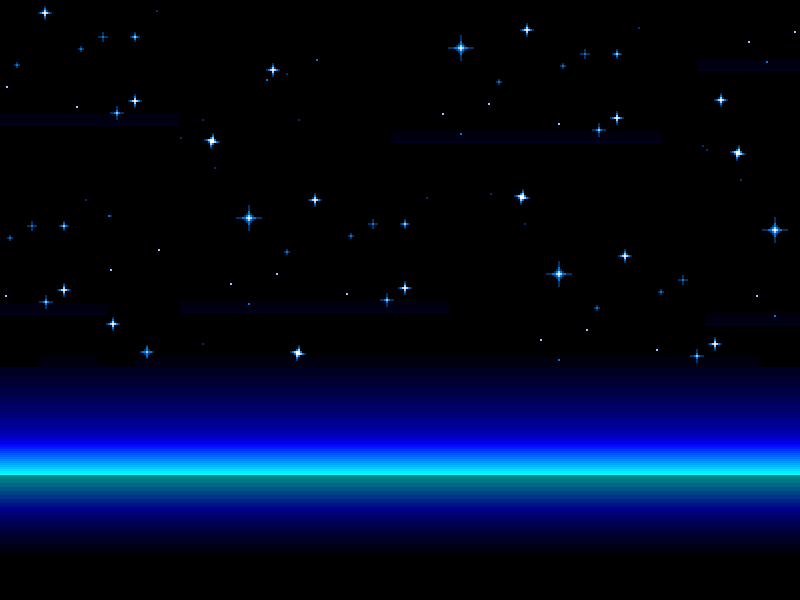

I built this game for my second milestone project for the Code Institutes Full Stack Software Development Course. The goal of the project was to build an interactive frontend game where users could play against themselves in a battle to win the game. The game is a clone of the original Atari Breakout game but with a twist. In order to win the game, the player must smash all bricks without losing the ball. The player has three lives within each level - to make it little easier for them. 

The twist to the game involves a bit of fight back. At some point in each game, Killer Red bricks will start to fall from the sky in a bit to kill the player. If the player gets hit by a brick - it’s instant GAME OVER! The bricks will fall from random points so it’s impossible to predict their next move.

The game has two levels at the moment, with more challenging levels planned for future releases.

### 
The image above is a visual of the site displayed on different devices using [I Am Responsive](http://ami.responsivedesign.is/#)

### 
You can view the live site here: [www.breakout-revenge.com](https://scotty-james.github.io/Breakout-MS2/)

---

### 
This game has been built for desktop only. To play, use the arrow keys to move the player from left to right.

---

## Contents

- [**User Experience (UX)**](#ux)
  - [User Stories](#user-stories)
  - [Strategy](#strategy)
    - [_External user’s goal_](#external-user’s-goal)
    - [_Site owner's goal_](#external-user’s-goal)
  - [Scope](#scope)
    - [_Scope In_](#scope-in)
    - [_Scope Out_](#scope-out)
  - [Structure](#structure)
  - [Skeleton](#skeleton)
    - [_Wireframes_](#mobile-wireframes)
  - [Surface](#surface)
    - [_Design_](#design)
    - [_Colour_](#colour)
    - [_Typography_](#typography)
- [**Features**](#features)
  - [_Existing Features_](#existing-features)
  - [_Features Left to Implement_](#features-left-to-implement)
- [**Technologies Used**](#technologies-used)
  - [_Languages_](#languages)
  - [_Frameworks & Libraries_](#frameworks-and-libraries)
- [**Testing**](#testing)
- [**Version Control Management**](#version-control-management)
- [**Deployment**](#deployment)
  - [_Deployment Steps_](#deployment-steps)
  - [_How To run this Project Locally_](#how-to-run-this-project-locally)
- [**Credits**](#credits)
  - [_Content_](#content)
  - [_Media_](#media)
  - [_Code_](#code)
- [**Resources**](#resources)
- [**Acknowledgements**](#acknowledgements)

---

## 
 UX

### User Stories

> - As a player, I want to see the game instructions before I play, so that my game experience is fun and enjoyable.
> - As a player, I want to be able to see my score as a play, so that I can feel a sense of competition against myself.
> - As a player, I want to play a game that adds further challenge in each level so that I can remain interested in the game as I master each level.
> - As a player, I want to see my final score even when I lose the game, so that I can aim to beat that score next time.
> - As a player, I want the game to be unpredictable in some way, so that the game doesn't become too static or boring.

### Strategy

#### External user’s goal

> - Play a game that is fun and interactive, that adds challenge to each level as the game progresses.
> - Play a single player game where I can compete against myself.
> - The game must be easy to play, using as little keyboard inputs as possible.
> - The game should include a score count and overall final score for each level - whether the game has been won or lost.
> - To sustain interest, the game should have multiple levels that become more challenging as the game progresses.

#### Site owner's goal

> - Create a game for single player game enthusiasts, where they need to achieve a certain goal in order to win the game.
> - Create a game that has multiple levels to ensure that the player’s interest in the game is sustained for as long as possible.
> - Create a game that provides additional challenge for each level introduced, making it harder to win as the player develops their game skills in each level.
> - Create a game that provides the environment for self competition, building the players enthusiasm to beat their score each time they lose/win.

### Scope

#### Scope In

- A retro style game for desktop use only where the user can play using their desktop keyboard keys to navigate.
- A game instructions button (modal) that provides the user with instruction on how to play the game.
- A preload screen that allows the player to start the game once they’ve read the game instructions.
- A score counter that increases each time the player smashes a brick within the game.
- A lives counter that allows the player to continue on with the game should they lose their ball before smashing all the bricks in a given level. Each level with provide the user with 3 lives.
- Additional challenge in the form of falling bricks, where the user will be killed instantly if they are hit by them.
- A final score display on either a game win or game lose scenario.
- Two levels with the second level offering more challenge than the first - in the form of a faster moving ball, and more bricks to destroy.
- Animation in the form of explosion when the ball collides with each brick, when a falling brick collides with the player, and the changing of player colour when the user loses the game.
- Sound effects for player and ball collision events.

#### Scope Out

- The game has initially been built for desktop only, therefore ability to play on a mobile device is out of scope for this first release.
- Mouse input as a way to control the game
- High score functionality that displayed the users highest score over multiple attempts.

### Structure

The structure of information of the game will follow a simple approach with 5 game scenes: These scense will follow a path dependant on the game outcome each time.

#### _Preload Scene_

> - The game will start with a preload scene that allows the player time to read the game instructions. The game instructions will be presented below the preload screen in the form of modal. The use will then be able to mouse click to the next scene in order to begin the game.

#### _Level One Scene_

> - The user will now be presented with the first level in the game. The game will only start when the user presses the spacebar - this instruction is presented to the user on screen, however, the visibility of this instruction disappears on the spacebar click event.

#### _Game Over Scene_

> - In the event that the user loses the game, a game over scene will display. This scene will display game over text, the users final score, and the ability to mouse click to try again.

#### _Level Complete Scene_

> - In the event that the user wins the game, a level complete scene will display. This scene will display game win text, the users final score for the level completed, and the ability to mouse click to move onto the next level.

#### _Level Two Scene_

> - The level two scene will commence only when the first level has been completed. The game will only start when the user presses the spacebar - this instruction is presented to the user on screen, however, the visibility of this instruction disappears on the spacebar click event.

### Skeleton

- The game has been designed to allow the user to flow through the game journey effortlessly.
- With a six scene structure, the user flow will be dependent on the outcome of each game.
- The preload scene will always display first when the user starts a brand new game. The user can then move to the first level in just one click.
- The game over scene will only ever display on the event that triggers a game over scenario.
- The level complete scene will only ever display when the level has been won.
- Level two will only ever display when level on has been completed and the user has passed through the level complete scene.

#### Wireframes

All wireframes were created using [Balsamic](https://balsamiq.com/).

[The PDF version of these wireframes can be found here](https://github.com/scotty-james/Breakout-MS2/blob/master/assets/docs/game-wireframes.pdf)

### Surface

#### Design

The game design is inspired by 1970’s retro game Atari Breakout and the aim was to retain this classic retro feel, although for the game design I have added background scenes that change with each level. Inspiration from the background scenes came in the form of different Sky settings - for level 1, I choose an evening sky, for level 2, the background is in the stars.

#### _Level One Background_

#### _Level Two Background_

#### Colour

The game is varied in colour due to the presence of background scenes however the HTML surrounding the game canvas.

- #DBC7E9
- #5a1354

#### Typography

In line with games simplicity I have only used one font throughout the game - Righteous. This font was obtained from [Google Fonts](https://fonts.google.com/specimen/Righteous?preview.text=Righteous&preview.text_type=custom)

I felt this font gave the game font a nice retro feel which was important in order to flow with the simplistic and retro design.

---

## 
Features

### Existing Features

- Game Instructions Modal displayed below the game canvas to ensure easy accessibility for the user to to understand how to operate the game.
- A game introduction scene before the game begins, to help build anticipation.
- Ability to start game when the user is ready in the form of start game text on screen and functionality for game to begin ‘on click’
- Dynamic score count which increases in points each time the user achieves points.
- A dynamic player lives count which starts at 3 and depreciates in values of 1 each time the player loses the ball.
- Animation events for when the player collides with objects in the game. This is in the form of an explosion animation when the player smashes a brick. This animation also plays on the event the player is hit by a falling brick.
- Sound effects that trigger on specific collision events.
- A dynamic game-over scene which displays when the user loses the game, this scene displays the user's high score for the previous game session.
- A dynamic level complete scene which displays when the user completes a level successfully, displaying the users high score for the previous level and allows entry into the next level on user action.
  - Two levels both with different levels of challenge. Level 2 has the following:
  - Increased brick count
  - Ball moves at a faster speed
  - Killer bricks fall at a faster speed

### Features Left to Implement

- More levels with varying degrees of complexity - for example, adding an additional ball to make the game much more challenging as the user improves their game skillset.
- Better high score functionality where the data is stored as an overall high score so the player can visually see their best.
- Ability to gain extra lives to keep the user engaged longer.
- Ability to score bonus points for hitting specific objects within the game.
- Stronger dynamically appearing animation to support bring the game more to life as each level progresses.
- Ability to play the game on mobile.
- Adding in additional user methods for controlling the game, such as using the mouse / touch as well as the keyboard.
- Tiles sprite sheets to enable easier design and build of brick structures within the game.
- More sound animations to support user engagement and anticipation levels as they progress through the game.

---

## 
Technologies Used

### Languages

- HTML5
- CSS3
- JavaScript

### Frameworks and Libraries

- [Phaser](https://labs.phaser.io/) - I used phaser as my core game development library.
- [Phaser Labs](https://phaser.io/) - Used to understand how various components of phaser worked, including animations etc.
- [Node JS](https://nodejs.org/) - Used during the initial development of the game due to having installed the phaser 3 master template.
- [Bootstrap](https://getbootstrap.com/docs/4.5/getting-started/introduction/) - was used for the modal structure that contains the game instructions.
- [Google Fonts](https://fonts.google.com/) - used to select the text font to be used throughout the site.
- [VS code](https://code.visualstudio.com/) - used as my IDE.
- [Git](https://git-scm.com/) - used for version control via VS code by providing regular commits to Git, and pushing to GitHub.
- [GitHub](https://github.com/) - for my Git repository.
- [Balsamic](https://balsamiq.com/) - used to create the website wireframes.
- [W3schools HTML Colour Picker](https://www.w3schools.com/colors/colors_picker.asp) - used to pick the colour theme for the website.
- [Tinyjpg](https://tinyjpg.com/) - used for image resizing.
- [Favicon Generator](https://favicon.io/favicon-converter/) - used for generating the site favicon.

---

## 
Testing

### W3C Validation

- index.html: No errors or warnings to show.
  

  style.css: Congratulations! No Error Found.
  

### JSHint

The following files were passed through JSHint with no warnings detected.

`/*jshint esversion: 6 */` was placed at the top of each file to ensure JSHint doesn't raise unnecessary warnings.

- config.js
- preloadScene.js
- levelOne.js
- levelTwo.js
- levelLost.js
- levelComplete.js

### User Story Testing Validation

> #### 
_As a player, I want to see the game instructions before I play, so that my game experience is fun and enjoyable._

- I’ve included a game instruction tab in the form of a modal which is embedded outside the game canvas and within the HTML structure.
- To ensure consistency as the player moves through the game, the game instructions tab remains in the same place as the player navigates from level to level.
  

> #### 
_As a player, I want to be able to see my score as a play, so that I can feel a sense of competition against myself._

- I have added a player score at the left top corner of the game.
- The score is dynamic and increases each time the user smashes a brick.
- To achieve the highest score, the player must destroy all bricks before losing all lives!

> #### 
_As a player, I want to play a game that adds further challenge in each level so that I can remain interested in the game as I master each level._

- I have created a second level to the game that includes the following additional challenge:
  - Increased brick count.
  - Bricks positioned at a lower point in the screen which will increase the impact count of the ball.
  - On each impact, the ball velocity increases slightly.
  - The general starting speed of the ball movement has been increased compared to level one.

> #### 
_As a player, I want to see my final score even when I lose the game, so that I can aim to beat that score next time._

- The final score is pulled into both game over and level complete scenes. This allows the user to see their overall final score for their previous attempt.

### _Game Over Scene_

### _Level Complete Scene_

> #### 
_As a player, I want the game to be unpredictable in some way, so that the game doesn't become too static or boring._

- I have added some randomness to the game in the form of falling bricks, these bricks will kill the player instantly on impact and appear randomly throughout the game.
- The speed of these falling bricks increase as the player progresses through each level.

### Browser Validation

In addition to testing on google chrome, I tested the game fully on the Safari and Firefox browsers.

- Firefox: All tests successful.
- Microsoft Explorer: All tests successful.
- Safari: Game would not load in safari. Investigation to be completed to find the issues. The main issue identified is the brower 'crashing' after about 15 seconds of the game loading. The text on screen is also not rendering as expected.

### Site Performance Validation

To test the sites performance I used Lighthouse in Chrome Dev Tools:

The site scored low on SEO mainly due the HTML file not having an appropriate meta description for the site's purpose. To solve this I added the following meta description:

`<meta name="description" content="Multiple Level DeskTop Game">`

After retesting, the SEO score improved to 100

### Manual Game Testing

| Functionality                                                                                    | UAT Result |
| ------------------------------------------------------------------------------------------------ | ---------- |
| Preload screen moves to level on screen on click                                                 | PASS       |
| Ball is released on pressing SPACEBAR                                                            | PASS       |
| SPACEBAR text visibility disappears when spacebar keyboard input event occurs                    | PASS       |
| Explosion animation on ball / brick collision event                                              | PASS       |
| Brick visibility disappears on ball/brick collision event                                        | PASS       |
| Ball bounces off all game boundaries except bottom boundary                                      | PASS       |
| Score logic increases dynamically on ball / brick collision event                                | PASS       |
| Lives logic decreases by one when ball falls below bottom game boundary                          | PASS       |
| Ball position reset on top of player paddle immediately after falling below bottom game boundary | PASS       |
| Falling brick functionality begins at predefined logic                                           | PASS       |
| Falling bricks fall from random areas of the game                                                | PASS       |
| Player colour turns red on falling brick/player collision event                                  | PASS       |
| Game pauses for 1500 ms on game over event before moving to the next scene automatically.        | PASS       |
| Game displays a fade in/out effect when transitioning between game scenes                        | PASS       |
| Game Over Scene appears after game over logic returns true on both level 1 & level 2             | PASS       |
| Level Complete Scene appears after game won logic returns true in both level 1 & level 2         | PASS       |
| Level 1 appears after an on click event on the Game Over Scene                                   | PASS       |
| Level 2 appears after an on click event on the Level Complete Scene                              | PASS       |
| Ball disappears from screen immediately when game over logic returns true                        | PASS       |
| Level 2 text returns when user enters level 2                                                    | PASS       |
| Final user score displays correctly in both Game Over and Level Complete Scenes                  | PASS       |

### Debugging

#### Phaser Debugging Tool:

> - As phaser uses a built in physics library to handle and resolve sprite collisions, movement etc. When setting the game config up, there is a debug option that when set to `true`, it displays boxes around each object in the game - the box is the physics body which determines collision impact points.
>
> - Moving objects will also display a green line when moving, this shows the direction the object is moving.
>
> - This allowed me to test all collision impacts to ensure they were impacting as expected. Phaser has a setCircle function that allows the developer to manipulate the collision parameters. For this game, I was happy that all impact collisions were performing as expected and felt no need to change these. Example below of the physics debugging tool.

#### Console Log:

- For general debugging throughout the game development I primarily used the console log, logging results of each new feature as I implemented them. Any error encountered was resolved through manual real time testing and code adaption to ensure results were returning as intended.

Throughout the SDLC, I applied a 'testing by playing' methodology. As each new feature was introduced, I would test all elements of the game implemented up to that point to ensure all code was running as intended to ensure any new code introduced did not affect code previously written.

#### Live Testing:

All manual UAT testing was also completed on the deployed version of the site.

---

### 
 Fixed Bugs

| Bug                                                                                                                                                            | Fix                                                                                                                                                                                                                                                                                      |
| -------------------------------------------------------------------------------------------------------------------------------------------------------------- | ---------------------------------------------------------------------------------------------------------------------------------------------------------------------------------------------------------------------------------------------------------------------------------------- |
| Game Canvas position was pulling below the screen, pulling the game objects out of user view                                                                   | Updated the game parameters in CSS using the ‘game’ id and added in Phaser ‘Scale’ Settings to config.js to center and resize the canvas on screen.                                                                                                                                      |
| When refactoring code, I added a fontStyle variable using ‘let’ in the global scope. However, the game was throwing an error in the console log as undefined.  | Updated the ‘let’ variable and assigned ‘this’ as the owner. This resolved the error. I then updated each variable to ‘this.fontStyle’ - example on line 42 in levelOne.js                                                                                                               |
| On screen text was not displaying as expected even after setting the X & Y parameters. The text was flowing off screen                                         | Added the ‘setOrigin’ object to the createGameText method, which aligned the text nicely in the centre by setting the origin to 0.5                                                                                                                                                      |
| The assets used for the game were displaying extremely large on screen. I found it challenging to find exactly how to resize them.                             | Searching stackoverflow, I found instructions that enabled me to resize the scale of any assets / game objects using the ‘Scale Manager Class in phaser 3. Example: line 65/65 & line 80 in levelOne.js                                                                                  |
| When I enabled falling bricks into the game, an error was returning in the console log when the brick / player impact event returned true                      | From the phaser documentation, I found that by changing the physics parameters from ‘collider’ to ‘overlap’, this resolved the problem.                                                                                                                                                  |
| When I created the new scenes, the functionality was behaving as expected, but when the new game was presented, the ability to start would not work.           | After a lot of debugging and troubleshooting, I realised that the gameHasStarted syntax was written incorrectly. this.gameHasStarted === false, was written as this.gameHasStarted = false                                                                                               |
| Explosion animation that occurs on the ball/brick collision event was not working after I had added animation parameters.                                      | Using the phaser documentation, I found the ‘setTexture’method. Adding this displayed the explosion sprite immediately after the brick visibility function removed the brick from the game                                                                                               |
| When the game over logic returned true, the next scene started immediately. I felt this was a poor user experience due to the speed at which the game changed. | Using a tutorial from Ourcade (game development website), I was able to find instructions on how to add a time delay to each scene - for both starting and ending. I implemented this across all scene to enhance UX                                                                     |
| When the delay functionality was added, the game felt very static during the set timed delay.                                                                  | Added the phaser physics property ‘pause’ which pauses all items on the screen. I then added the physics ‘tint’ property to the function which changed the colour of the player to red when the game over logic returned true. This provided a nicer flow to the next scene in the game. |
| When the game over logic returned true, the ball would freeze in its current position.                                                                         | To avoid this, I updated the game lost function by disabling the ball body when the function was called - this then changed the ball visibility to false, removing it from the screen completely.                                                                                        |
| When I added the player lives function, the ball would disappear from the screen, effectively disabling the player from continuing.                            | I created a new ballReset() method that when caled set the balls position to the original y axis when the game started, and to the x axis of the player. This then meant the ball would always return to the top of the paddle - no matter where the paddle was onscreen.                |

---

### Remaining Bugs:

The explosion animation that triggers on the ball / brick collision event is not working as intended. Although the animation does look like an explosion, the spritesheet used should bundle all frames togethers, giving a single explosion animation effect. This will be fixed in a future release. FIX DEPLOYED 19/01/20

### Deployment issues encountered:

> When I was preparing for my first game deploy, a sizable issue was discovered.
>
> When setting up the game, I used the [phaser three master template](https://github.com/photonstorm/phaser3-project-template). This required Node.js to install all dependencies and run scripts via `npm` this required me to do the following:
>
> To set the project template up, I followed the following steps:
>
> 1.  Cloned the phaser 3 template repo
> 1.  Run `npm install` in the terminal
> 1.  Run `npm start`
>
> Running npm start allowed me to see the project http://localhost:8080 - which I used for testing fromout the game development.
>
> As I moved toward the end of the project, in order to deploy my site I had to run another npm command - `npm run build`. This packaged all of my code into a single bundle located in a `dist` folder.
>
> The `dist` folder contained the code for the game, but not the assets. After lots of troubleshooting and verifying my path directories I could not find a way to effectively get the assets into the `dist` folder. This would prevent me from deploying my site on GitHub Pages.
>
> Anyone else who had cloned my project at this stage would also not be able to see the project in any live web server without running the 'npm start' command
>
> As a workaround, I recreated the game using the phaser 3 jsDelivr CDN ``
>
> I was able to get the game working in the same way. I then removed all `phaser 3 project template files`, `node modules` and the installed `webpack` and reconfigured the game accordingly.
>
> The changes I made to the project set up can be seen on this [commit](https://github.com/scotty-james/Breakout-MS2/commit/7d16611cfc24d363713970230c3874debe766f5f)

---

## 
Version Control Management

I used Git for version control on this project.

- All code was written in VS Code.
- At regular intervals and when new features were added to the site, I added all changes to the staging environment using source control panel in VS code.
- I then committed to the local repository using commit functionality in VS code.

Throughout the development lifecycle of the site, I used commit messages that were in the imperative language!

- I then used the git push command to push the local git to my git repository (GitHub)

---

## 
Deployment

### Deployment Steps

The following steps were taken to deploy this website to Github pages from it’s main Github repository. Log into my Github account.

1. Navigate to the site’s repository.
1. Under the site repositories name, click ‘Settings’
   

1. Scroll down the page to ‘GitHub Pages section’
1. Under Source, click on the dropdown tab that is defaulted to ‘None’
   Select ‘Branch: Master, then hit Save.
   

1. At this point, the page is automatically refreshed and the website is deployed.
1. Scroll back down to the GitHub pages section to obtain the url to the newly published site.
   

### How To run this Project Locally

1. [Click here to access the site's repository](https://github.com/scotty-james/Breakout-MS2)
1. Underneath the repository name, click ‘Code’ which will open a drop down menu.
1. Click the HTTPs section (a red line should be displayed underneath).
1. To clone the repository using HTTPS, under "Clone with HTTPS", click the clipboard icon.
1. Open your IDE terminal
1. Type ‘git clone’ and paste in the url you just copied - it should look like this `$ git clone https://github.com/scotty-james/Breakout-MS2.git`
1. Press enter which will then create your local clone.

---

## 
Credits

### Content

All content on the site was written by the game developer.

### Media

- [Canva.com](www.canva.com) was used to design my README.md logo.
- [Open Game Art](https://opengameart.org/content/breakout-brick-breaker-tile-set-free) + [Kenny Puzzle Pack Assets](https://www.kenney.nl/assets/puzzle-pack): I used both these free asset packs for my game assets.
- [Phaser GitHub Assets:](https://github.com/photonstorm/phaser3-examples/tree/master/public/assets) Used for all other assets in the game -[Freesound.org](https://freesound.org/) I used freesound.org for all game audio assets

### Code

- [Phaser 3 Project Template:](https://github.com/photonstorm/phaser3-project-template) This template provided the basic building blocks for the game, including the code written in the config.js file.
- [Stackabuse Tutorial:](https://stackabuse.com/introduction-to-phaser-3-building-breakout/) I used this tutorial to build my first basic breakout game before starting my project.
- [Switching between scenes:](https://www.thepolyglotdeveloper.com/2020/09/switch-between-scenes-phaser-game/) I used this tutorial to enable me to switch between scenes in the game when using the CDN instead of the uploaded project files I had used in the early part of developing the game.
- [Phaser 3 Game Tutorial:](https://phaser.io/tutorials/making-your-first-phaser-3-game/part10) I used the code in this tutorial to create the parameters for the falling bricks within the game - the code was modified to suit this particular game. I also used this tutorial to build my first phaser 3 game as part of my prior learning before building the breakout clone.
- [Stackoverflow:](https://stackoverflow.com/questions/57566322/how-do-i-scale-a-group-in-phaser-3) I used the instructions from this stackoverflow to set the scale/size of sprites within my game.
- [Stackoverflow:](https://stackoverflow.com/questions/56612028/how-can-i-pass-data-from-a-scene-to-another-in-phaser-3/56612898#56612898) Using this stackoverflow question, I was able to figure out how to pass the user score data from one scene to another, enabling me to display the high score on both the level complete and game over scenes.
- [Ourcade Blog:](https://blog.ourcade.co/posts/2020/phaser-3-fade-out-scene-transition/) I used the code from this blog to enable a fade out effect during game scene transition.

---

## 
Resources

Resources used for general learning / problem solving

- [Phaser Documentation](https://photonstorm.github.io/phaser3-docs/index.html)
- [Phaser Git Hub Library](https://github.com/photonstorm/phaser3-examples/tree/master/public/assets)
- [Phaser Game Development Tutorials](https://phaser.io/tutorials/making-your-first-phaser-3-game/part1)
- [Phaser Labs](http://labs.phaser.io/)
- Code Institute Slack Community
- Code Institute Course Content completed to date
- Youtube - mostly [Ourcade](https://www.youtube.com/playlist?list=PLumYWZ2t7CRudKWUMB2X9ZavtfpJ-yu7Q) for phaser 3 tutorials and walk throughs which I found very useful
- [Ourcade Game Development Blog](https://blog.ourcade.co/)
- W3schools
- Stackoverflow
- Stackabuse
- Jonas Schmedtmann JS Udemy Course
- MDN Mozilla

---

## 
 Acknowledgements

> - I would like to thank and acknowledge my mentor Spencer Barriball for the kind words of encouragement right from my very first planning call, and for providing inspiration for the project development and guidance throughout - thank you!
> - The Code Institute Slack Community which continues to be a huge treasure trove of knowledge when troubleshooting issues or looking for inspiration.
